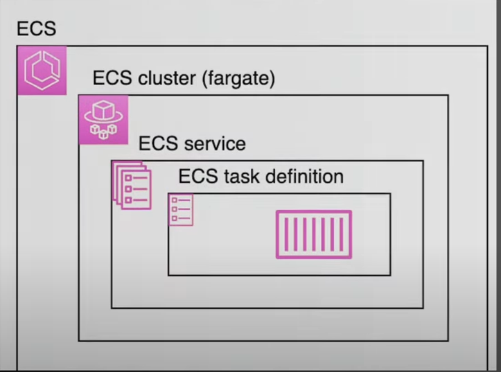
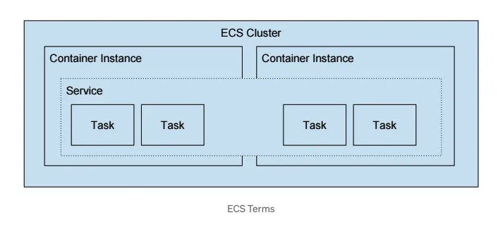

# aws-solution-architect-course

## ECS

  ECS is a cloud based container management service that allows to run and manage docker containers on a cluster of virtual servers.
  
## Why ECS?

- It automatically handels:
  - Apps Creation
  - Apps Management
  - Apps Update

### ECS Terms

- <b>Cluster</b> : Group of task and services, host all the resources and infrastruture.
- <b>Service</b> : Handle scalability and load balancing of your containers.
- <b>Task</b>: Represent running containers of your application.
- <b>Task Definitions</b>: This handles which image will run in a task containers, like which apps image version will be used to run the task. Also it has few more properties like port binding and networking.

## ECS Cluster

- Create ECS cluster which contains the following properties:
  - Name of cluster
  - Namespace name
  - Infrastructure
    - AWS Fargate(Serverless)
    - Amazon EC2 Instances
      - Add Auto Scaling Group
      - Ec2 Machine operting system like linux/windows
      - Instance Type
      - Desired Capacity
        - Min
        - Max
      - EBS volume storage
      - Network Setting for EC2 instances
        - VPC
        - Subnets
        - Security Groups
        - Auto Assign Public IP

    - External instances using ECS anywhere
  - Monitoring(Optional)
  - Tags (Optional)

## ECS Service

- <b>Create Task Definition</b>
  - In AWS ECS, a Task definition is a blueprint that defines how the containrized applications should run. In specifies the container images like container images, resource allocation, environment variables, networking, storage and logging, ensuring consistent deployment and managing of ECS tasks and service.

- <b>ECS Service Autoscaling</b>:
  - Automatically decrease/incread desired number of ECS task
  - Amazon auto scaling uses <i>AWS Application Auto Scaling</i>, which have three ways to scale the application
    - ECS service average CPU utilization
    - ECS service average Memory Utilization - Scale in RAM
    - ALB request count per Target - metric coming from ALB
  - Target Tracking: Scale based on target values for a specofic cloudwatch metric
  - Step Scaling: Scale based on a specified CloudWatch Alarm
  - Scheduled Scaling: Scale based on specfic date/time(Predictable change)
  - Important to note here, ECS auto scaling(Task Level) != EC2 Auto Scaling(EC2 instance level) if you are using Launch Type as EC2.
  - EC2 Launch Type: Auto Scaling EC2 instances
    - Accomodate ECS scaling by adding underlying EC2 instances
    - Auto Scaling Group Scaling
      - Scale your ASG bases on CPU Utilization
      - Add EC2 instances overtime
    - <b>ECS Cluster Capacity Provider</b>
      - Used to automatically provision and scale infra for your ECS Task
      - Capacity provider paired with an Auto Scaling Group
      - Add EC2 instances when you're missing capacity(CPU, RAM..)
      

## ECS Workflow
- Reprentation of ECS service and its components:

  

- Representation of ECS cluster:

  
